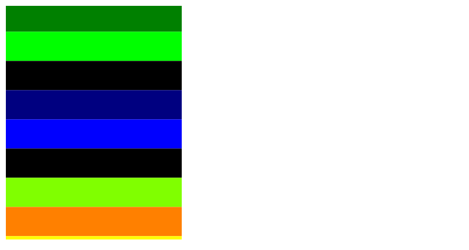
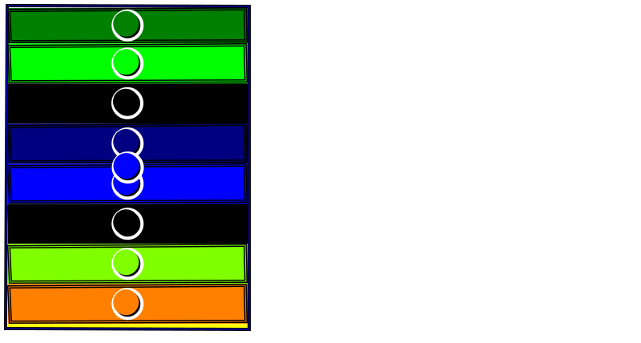

# Scroll Test

This is the first proof of concept for testing Famous' scroll region.

In anticipation of  more complex scenarios (3d tilting, etc.) computer vision is used on a snapshot
taken by webdriver of a specially colored set of surfaces after a few seconds of scrolling.

The test is run on a Scroll Container.

wd opens a page in Google Chrome and sets the window size to a fixed size (800 px x 500 px).

The scrolling is initiated by a click on a button to start a free-fall scroll at low speed:

``` javascript

    scroller.scrollview._eventInput.emit('start', {slip: true});
        buttonMod.setOpacity(0);
        setTimeout(function () {
            scroller.scrollview._eventInput.emit('update', {delta: -120, position: -120, velocity: -0.1, slip: true});
        }, 10);
```

(clicking also self-hides the button).

After two seconds, the state of the page is screenshot and the page is closed.

Then a computer vision(openCV) scan is run on the shapes found and the perimiter of each surface is found.
The center of each rectangle is found by averaging all the contour points.
The color at that center is also measured (via canvas) and all the above data is saved.

Then a linear regression is made comparing the known expected non-black surfaces' colors against the known order of
surface colors. All the above data is saved to JSON.

The expected output is around slope = 49 (due to the size of the surface and an intercept of -149 (about how far the
surfaces travel.

A few runs show that these numbers are consistent from test to test
(+/-2 px slope at the extreme, +/- 5 on the surfaces travel.

A more thorough statistical analysis is to come.

## output

Two images and a JSON file is saved by running the test, into the tests folder:

* the raw screenshot after two seconds of scrolling (`outCanvas.png`)
  
* the screenshot with computer vision markup (`out_contour.png`)
  
* the data JSON (`data_hits.json`)
```
{
   data: [
    {
      index: int, // the number of the surface found by matching the color to the colorlist json
      color: [int x 4], // rgba
      center: {x: float, y: float} // the average of all the points found by cv of the contour
    } ... {}

   ],
   slope: float, // around 49
   intercept: float // around 168
}
```
note that the intercept is the "money value" here - it is the amount of scrolling that
occurs in 2 seconds. slope of c: 49 is a validation that

* the content surfaces are of normal size
* that the opencv contour scan is working properly.

## Setup Requirements

A fair amount of software is required to run this test.

1. ** Selenium Sserver with the Google Chrome plugin **

The tests runs under selenium; both the selenium server and the chrome plugin is required.
The webdriver is included in the `server` directory; however you might want to get both the server and the plugin
yourself from the net as they are frequently updtaed to keep up with browser upgrades.

`the server.sh` script will initialize the server.

2. ** OpenCV **

Installing openCV is a bit of a chore; I reccommend using Homebrew and calling `brew install opencv`

3. ** Cairo **

Cairo is required by node-canvas and is notoriously tempermental. `brew install cairo` may work for you but don't
be surprised if it is troublesome to get working right. (I had to manually relink a lot of the components post install

4. ** a bunch of node modules **

the webdriver (wd), computer vision(opencv), node-canvas and a host of support modules are needed to reun the test

5. ** grunt command line **

See Grunt Docs for details -- enable the grunt command line runner.

## Running the tests

1. Run the Grunt task `grunt serve` to expose the main server on port 1337 ('L33T').

2. run the node script `tests/scroll_test.js`.

You should see the scroll page open and after a second or so, the "CLick to scroll" button disappears and the scroller
starts scolling.

Two seconds later the window closes and the post processes of the test updates the files listed in **output** above.

